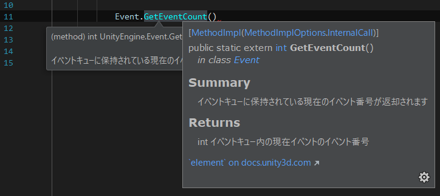

## これは何？

統合開発環境でUnity用のプロジェクトを編集する際の、Intellisenseが表示するリファレンスを日本語化するためのファイル（以下、「日本語化ファイル」）を合成するツールです。
（日本語化ファイルそのものではありません）

  
※Riderでの動作例

## 超重要な注意事項

このツールが合成した日本語化ファイルは、「再配布不可」です。（ユニティ・テクノロジーズ社にも確認済み）  
また、本ツール及びツールが合成した日本語化ファイルに関連する諸問題を、ユニティ・テクノロジーズ社に問い合わせることはしないでください。

## 制限事項

現状では、日本語化できるのは MonoDevelop あるいは Rider のIntellisenseです。

Visual Studio Code の場合は、うまく日本語化できません。  
（無理やり日本語化する方法はありますが、初心者にはオススメしません。なぜうまく日本語化されないのか、お分かりの方がいましたら是非ご教示いただきたく…）

また、本ツールは、ユニティ公式の日本語版スクリプトリファレンスから、日本語テキストを抽出して利用しています。  
そのため、公式ドキュメントがまだ英語のままの個所は日本語化されません。

## 日本語化ファイルを合成するために必要なもの

- Unityがインストールされた Windows/Mac
  - Unity のバージョンはおそらく問わない
- Ruby
  - 2.4で確認
  - nokogiri の gem が必要なので、入ってない場合は `$ gem install nokogiri` すること
- Unity公式の日本語版オフラインマニュアル
  - Unityのバージョンに合わせたものを、公式サイト（ https://docs.unity3d.com/ja/current/Manual/OfflineDocumentation.html ）からダウンロードし、適当なフォルダに展開しておくこと

## 日本語化ファイルの合成手順

1. 適当なフォルダに generate-xml.rb と settings.rb を置く
2. settings.rb を開いて、以下の２つのパスを、説明に従って書き換えて保存
   - UNITY_DATA_PATH
   - UNITY_DOC_SRC_PATH  
3. 1.のフォルダをカレントディレクトリにした状態で、コマンドラインから
   `$ ruby generate-xml.rb`
4. 処理が終了すると、カレントディレクトリ に `xml/MonoDevelop_or_Rider` と `xml/VSCode` というフォルダが作られます

## 日本語化ファイルの適用手順

### MonoDevelop あるいは Rider(JetBrains) の場合

1. UnityおよびMonoDevelop,Riderを終了させます。
2. `xml/MonoDevelop_or_Rider` フォルダ内にある Managed と UnityExtensions フォルダを、UNITY_DATA_PATH に指定したフォルダにコピー（結合）します。  
この時、Unityインストール時に作られたファイルは一切上書きされません。  
既存のいくつかのフォルダの下に ja というサブフォルダが作られ、そこに日本語化ファイルが置かれます。  
当然、日本語化ファイルだけを削除すれば元に戻ります。

### VisualStudioCode の場合

（初心者には非推奨。最悪Unityをインストールしなおす羽目になります）

1. UnityおよびVisualStudioCodeを終了させます。
2. `xml/VSCode` フォルダ内にある Managed と UnityExtensions フォルダを、UNITY_DATA_PATH に指定したフォルダにコピー（結合）します。  
この時、Unityインストール時に作られたファイルが一部上書きされ、VisualStudioCode側の言語設定に関係なく、強制的にIntellisense が日本語になります。  
元に戻すには、上書きされるファイルを事前にバックアップしておいてリストアするか、Unity の再インストールが必要です。

## 日本語化の仕組み

Unityをインストールしたフォルダには、Intellisenseがリファレンスを表示する際に参照するXMLファイルが多数存在します。  
（Windowsなら、たとえば C:/Program Files/Unity/Editor/Data/Managed/UnityEngine.xml など）  
これらのXMLファイルには、UnityEngine.* および UnityEditor.* のクラス・メソッドの説明が書かれた英文テキストが含まれています。  

一方で、Unity の公式サイトからは、HTMLで書かれた日本語版のスクリプトリファレンスがダウンロード可能で、この中には。UnityEngine.* および UnityEditor.* のクラス・メソッドの説明が書かれた日本語テキストが含まれています。

この両者をいい感じに合成してやることで、Intellisenseを日本語化するためのXMLファイル（以下、日本語化ファイル）が作れます。  
実際には日本語版のHTMLファイルを雑にパースして、英語版のXML中の説明テキストを置換しているだけです。

## Visual Studio Codeでうまく機能しない問題

MonodevelopおよびRider向けでは、英語版のXMLファイルがあるフォルダに ja というサブフォルダを作って、そこに英語版と同名で日本語化したXMLファイルを置いています。

しかし、このやり方では Visual Studio Code ではうまくいきません。  
現状では、なぜうまくいかないのか、そもそも ja フォルダを置くやり方が正しいのかすらわかっていません。  
もっと言えば、Intellisense の多言語対応に関する仕様を記述した公式のドキュメントがどこにあるのかすら探しきれていません。  
